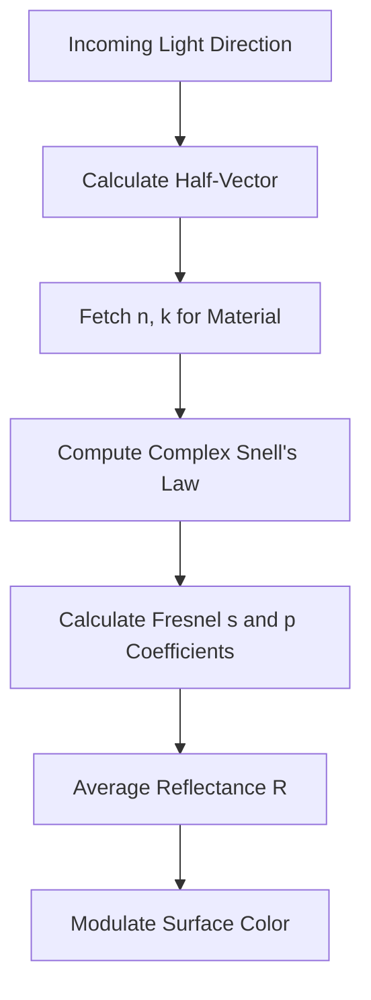

# Implementing Complex Fresnel Equations for Conductors

In physically-based rendering (PBR), one of the most common visual artifacts occurs when metallic surfaces appear too "dim" or improperly colored at grazing angles. This usually happens because developers rely on the standard Schlick’s approximation, which was originally derived for dielectrics. To achieve high-fidelity materials, we must move beyond simple approximations and implement the complex Index of Refraction (IOR) Fresnel equations for conductors.

## Understanding the Complex Index of Refraction

For non-conductors (dielectrics), the IOR is a real number. However, for conductors (metals), the interaction with electromagnetic waves is described by a complex refractive index: 

$$\eta = n + ik$$

Here, $n$ represents the refractive index and $k$ is the extinction coefficient. These parameters are frequency-dependent (wavelength-dependent), meaning a physically accurate material must sample these values across the visible spectrum. When light hits a metal at an angle $\theta_i$, the reflection is defined by the Fresnel equations for complex materials.

## The Fresnel Equations for Metals

Unlike the simplified Schlick approximation, which creates a fixed curve, the Fresnel equations for metals provide a precise calculation of reflectivity based on the complex IOR. The reflectance $R$ for both parallel ($s$) and perpendicular ($p$) polarization components is determined by the internal angle of refraction, which becomes complex for conductors.

Using these equations ensures that metals exhibit the correct "edge tint" and high-reflectance behavior at grazing angles—a critical component of the "metallic look."

[PLOT_SCRIPT]
import matplotlib.pyplot as plt
import numpy as np

def calculate_fresnel_metal(n, k, theta_deg):
    theta = np.radians(theta_deg)
    cos_theta = np.cos(theta)
    sin_theta = np.sin(theta)
    
    # Complex dielectric constant
    epsilon = (n + 1j * k)**2
    
    # Snell's law in complex form
    sin_sq_theta_t = (1 / epsilon) * (sin_theta**2)
    cos_theta_t = np.sqrt(1 - sin_sq_theta_t)
    
    # Fresnel for s and p polarization
    rs = (cos_theta - epsilon * cos_theta_t) / (cos_theta + epsilon * cos_theta_t)
    rp = (epsilon * cos_theta - cos_theta_t) / (epsilon * cos_theta + cos_theta_t)
    
    R = 0.5 * (np.abs(rs)**2 + np.abs(rp)**2)
    return R

theta = np.linspace(0, 90, 100)
# Gold example: n=0.17, k=3.1 (approx at 550nm)
reflectance = calculate_fresnel_metal(0.17, 3.1, theta)

plt.figure(figsize=(8, 5))
plt.plot(theta, reflectance, label='Complex Fresnel (Gold)', color='gold', linewidth=2)
plt.title('Reflectance of Gold vs. Incidence Angle')
plt.xlabel('Incidence Angle (degrees)')
plt.ylabel('Reflectance (R)')
plt.grid(True)
plt.legend()
plt.savefig('plot.png')
[/PLOT_SCRIPT]

## Implementation Architecture

To integrate this into a modern shading pipeline, we typically structure the calculation within the light transport loop. The following logic flow illustrates how the complex Fresnel coefficient is computed during the material evaluation phase:

## Why Standard Approximations Fail

Standard implementations often use $F_0$ (reflectance at normal incidence) and interpolate toward 1.0 at 90 degrees. For metals, the reflectance does not simply transition to 1.0; the color shift and the rate of falloff depend entirely on the extinction coefficient $k$. Ignoring this leads to the "plastic-like" or "flat" look common in engines that lack support for spectrally accurate IOR data.

For those looking to deepen their understanding of these light transport fundamentals, I highly recommend exploring *Digital Rendering Engineering, Vol. 1 — The Physics of Light*. It provides a rigorous mathematical foundation for these complex calculations, which are essential when building professional-grade, physically-based shading engines. Mastering these equations allows for the creation of materials that respond accurately to lighting environments, ensuring that your digital assets hold up under extreme grazing angles.