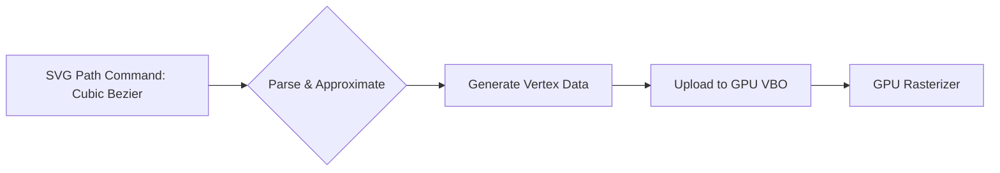

# From SVG to GPU: A Beginner's Guide to Hardware-Accelerated Vector Rendering

As a Senior Rendering Engineer, I've seen countless developers struggle with the disconnect between the declarative simplicity of Scalable Vector Graphics (SVG) and the imperative, performance-critical demands of modern graphics hardware. Many are familiar with SVG's XML-based description and its ubiquitous use in web development, but translating that high-level description into efficient, hardware-accelerated rendering on the GPU can feel like bridging a chasm. This guide aims to demystify that process, offering a beginner-friendly pathway from SVG concepts to GPU pipelines. We’ll explore how to break down SVG primitives and leverage techniques like rasterization and shader programming to achieve performant vector rendering.

## Understanding the SVG Model for GPU Processing

SVG is fundamentally a description of geometric shapes, paths, and styling. For GPU rendering, we need to translate these descriptions into a format that the graphics pipeline can understand and process efficiently. The core SVG elements—`path`, `rect`, `circle`, `ellipse`, `line`, `polygon`, `polyline`, and `text`—all represent geometric primitives. However, their direct interpretation by the GPU isn't straightforward.

The GPU excels at processing large amounts of data in parallel, typically through rasterization. This means converting vector shapes into a grid of pixels. While this is the underlying mechanism for rendering most raster graphics, it can introduce aliasing and require significant computational power for complex vector scenes if not handled correctly.

### Paths: The Cornerstone of SVG Geometry

SVG's `path` element is its most powerful and versatile tool. It uses a mini-language within its `d` attribute to define complex shapes using a series of commands:

*   **M (moveto):** Starts a new sub-path at a given coordinate.
*   **L (lineto):** Draws a straight line from the current point to a new point.
*   **H (horizontal lineto):** Draws a horizontal line.
*   **V (vertical lineto):** Draws a vertical line.
*   **C (curveto):** Draws a cubic Bézier curve.
*   **S (smooth curveto):** Draws a smooth cubic Bézier curve, inferring the control point.
*   **Q (quadratic curveto):** Draws a quadratic Bézier curve.
*   **T (smooth quadratic curveto):** Draws a smooth quadratic Bézier curve.
*   **A (elliptical arc):** Draws an elliptical arc.
*   **Z (closepath):** Closes the current sub-path by drawing a straight line to its starting point.

For GPU rendering, these path commands need to be converted into a sequence of vertices and primitive types that a graphics API (like Vulkan, DirectX, or Metal) can process. This often involves tessellation or discretization of curves into line segments.

### Transforms and Styling: Beyond Geometry

SVG also defines transformations (`translate`, `rotate`, `scale`, `skew`, `matrix`) and styling properties (`fill`, `stroke`, `stroke-width`, `opacity`).

*   **Transforms:** These are matrix operations that can be applied to geometric primitives. On the GPU, these translate to matrix multiplications applied to vertex data. For instance, a `translate(tx, ty)` can be represented by a translation matrix:
    
$$
    \begin{bmatrix}
    1 & 0 & t_x \\
    0 & 1 & t_y \\
    0 & 0 & 1
    \end{bmatrix}
    $$

    When applied to a vertex $(x, y)$, the transformed vertex $(x', y')$ is calculated as:
    
$$
    \begin{bmatrix}
    x' \\
    y' \\
    1
    \end{bmatrix} =
    \begin{bmatrix}
    1 & 0 & t_x \\
    0 & 1 & t_y \\
    0 & 0 & 1
    \end{bmatrix}
    \begin{bmatrix}
    x \\
    y \\
    1
    \end{bmatrix} =
    \begin{bmatrix}
    x + t_x \\
    y + t_y \\
    1
    \end{bmatrix}
    $$

*   **Styling:** `fill` and `stroke` properties dictate how a shape is rendered. `fill` typically means rasterizing the interior of a closed path, while `stroke` means rendering the outline. These translate into shader logic. For instance, determining if a pixel is inside or outside a polygon (for fills) is a classic point-in-polygon test, often implemented efficiently in shaders. `stroke-width` requires offsetting the path to create the stroke, which can be a complex geometric operation.

## GPU Rendering Pipeline Overview

To understand how SVG is rendered on the GPU, we need a basic grasp of the graphics pipeline. In essence, it's a series of programmable stages that transform 3D (or 2D) geometry into pixels on the screen. For vector graphics, we often operate in a 2D space, but the principles are similar.

A typical pipeline involves:

1.  **Vertex Shader:** Processes individual vertices, transforming them from model space to clip space (and often further to screen space). This is where SVG transforms are applied.
2.  **Tessellation (Optional):** If curves are not directly supported or are too complex, tessellation can subdivide them into smaller line segments or triangles.
3.  **Geometry Shader (Less Common for Basic SVGs):** Can create or destroy primitives.
4.  **Rasterizer:** Converts geometric primitives (triangles, lines) into fragments (potential pixels). This is the core step where vector geometry becomes pixel data.
5.  **Fragment Shader:** Processes each fragment, determining its final color. This stage handles SVG styling like fills, strokes, and opacity.
6.  **Output Merger:** Blends fragments and writes them to the render target (your screen).

## Bridging the Gap: Techniques for Hardware Acceleration

The challenge for beginners is mapping SVG's declarative nature to the imperative, step-by-step process of the GPU pipeline. Here are key techniques:

### 1. Vertex Buffer Objects (VBOs) and Index Buffers

Instead of sending path commands one by one, we first parse the SVG and generate a set of vertices. These vertices are then uploaded to the GPU as Vertex Buffer Objects (VBOs). For complex shapes, an Index Buffer can be used to efficiently reference these vertices and form primitives (e.g., triangles for fills).

For example, a simple square defined in SVG:
```xml
<rect x="10" y="10" width="100" height="100" fill="blue" />
```
Can be represented by four vertices: `(10, 10)`, `(110, 10)`, `(110, 110)`, `(10, 110)`. These vertices can be uploaded to a VBO. The GPU can then be instructed to draw a triangle strip or two triangles using these vertices to form the square.

### 2. Converting Curves to Line Segments (Approximation)

Bézier curves and elliptical arcs are computationally expensive to rasterize directly. A common technique is to approximate them with short line segments. The number of segments determines the smoothness of the curve. This is a trade-off between visual fidelity and performance.

The approximation of a cubic Bézier curve from $P_0$ to $P_3$ with control points $P_1$ and $P_2$ at parameter $t$ is given by:

$$
B(t) = (1-t)^3 P_0 + 3(1-t)^2 t P_1 + 3(1-t) t^2 P_2 + t^3 P_3
$$

We can sample $B(t)$ at discrete values of $t$ (e.g., $t = 0, 0.1, 0.2, \dots, 1.0$) to generate a series of points that approximate the curve. These points become vertices in our VBO. The choice of step size for $t$ is critical; smaller steps yield smoother curves but increase vertex count.



### 3. Shader-Based Rendering and Rasterization Techniques

While the GPU's built-in rasterizer handles triangles and lines efficiently, more advanced techniques can be employed for complex SVG features:

*   **Fragment Shader for Fills:** Instead of rasterizing complex polygons into triangles, a fragment shader can perform a point-in-polygon test for each pixel. This is particularly useful for non-convex or self-intersecting paths. The winding number or ray casting algorithms can be implemented in shaders.
*   **Stroke Rendering:** Drawing strokes involves rendering the outline of a path. This can be achieved by:
    *   **Offsetting paths:** Geometrically offsetting the path inwards and outwards and filling the resulting region. This can be complex to implement robustly.
    *   **Geometry Shader:** For line primitives, a geometry shader can be used to extrude lines into quads (rectangles) with the specified `stroke-width`.
    *   **Fragment Shader with Distance Fields:** For smoother, more controllable strokes, Signed Distance Fields (SDFs) can be used. While typically associated with fonts, SDFs can also be generated for vector shapes to render outlines with precise control over thickness and anti-aliasing.

Let's consider a simple mathematical function for interpolating along a line segment. If we have two points $P_1 = (x_1, y_1)$ and $P_2 = (x_2, y_2)$, any point $P$ on the line segment can be represented as:

$$
P(t) = P_1 + t(P_2 - P_1)
$$

where $0 \le t \le 1$. Expanding this for coordinates:

$$
x(t) = x_1 + t(x_2 - x_1)
$$


$$
y(t) = y_1 + t(y_2 - y_1)
$$

This linear interpolation is fundamental for approximating curves with line segments or for drawing strokes.


<div style="background: #0d1117; border-left: 4px solid #00f3ff; border-radius: 6px; padding: 20px; margin: 30px 0; box-shadow: 0 4px 15px rgba(0,0,0,0.3);">
    <h4 style="margin: 0 0 10px 0; color: #e6edf3; font-size: 1.2rem; font-family: 'Inter', sans-serif;">Master the Complete Architecture</h4>
    <p style="color: #8b949e; margin: 0 0 15px 0; font-size: 0.95rem; font-family: 'Inter', sans-serif;">If you are enjoying this deep dive, consider reading the full mathematical thesis in <strong>Digital Rendering Engineering: The Complete Substrate</strong>. Get direct access to all HLSL source code packs, premium physical copies, and the entire chapter library.</p>
    <a href="https://dre.jmsage.pro" target="_blank" style="display: inline-block; background: transparent; border: 1px solid #00f3ff; color: #00f3ff; text-decoration: none; padding: 8px 16px; border-radius: 4px; font-weight: bold; font-size: 0.85rem; text-transform: uppercase; transition: 0.2s;">Explore the Storefront →</a>
</div>


### 4. GPU Tessellation Shaders

Modern GPUs offer tessellation shaders (Hull Shader, Tessellation Control Shader, Tessellation Evaluation Shader, Tessellation Primitive Shader). These stages can dynamically subdivide primitives on the GPU. For SVG curves, tessellation can automatically generate finer-grained geometry from a few control points, reducing the CPU's workload and providing smooth results without manual approximation. This is particularly powerful for complex Bézier curves and arcs.

### 5. Shader-Based Vector Rasterization (Advanced)

For ultimate flexibility and performance, especially for very complex or dynamic SVG content, one can implement a full vector rasterizer within a compute shader or fragment shader. This involves:

*   **Storing SVG data:** Representing SVG primitives (paths, curves, etc.) in GPU-accessible memory (e.g., buffers, textures).
*   **Shader logic:** Writing shaders that iterate over pixels or thread groups and perform geometric tests to determine if a pixel is covered by a shape, considering fills, strokes, and styling.
*   **Anti-aliasing:** Implementing anti-aliasing techniques directly in the shader, such as multi-sampling or coverage sampling.

This approach bypasses traditional rasterization hardware for the vector primitives themselves, offering fine-grained control but requiring a deep understanding of GPU programming and shader languages (HLSL, GLSL, MSL).

## Example: Approximating a Cubic Bézier Curve

Let's illustrate the concept of approximating a cubic Bézier curve with line segments using Python and Matplotlib to visualize the process. This Python script will plot the Bézier curve and a series of line segments approximating it.

```python
import matplotlib.pyplot as plt
import numpy as np

def bezier_curve(t, p0, p1, p2, p3):
    """Calculates a point on a cubic Bezier curve."""
    return (1-t)**3 * p0 + 3*(1-t)**2 * t * p1 + 3*(1-t) * t**2 * p2 + t**3 * p3

def approximate_bezier(p0, p1, p2, p3, num_segments=50):
    """Approximates a cubic Bezier curve with line segments."""
    t_values = np.linspace(0, 1, num_segments + 1)
    points = np.array([bezier_curve(t, p0, p1, p2, p3) for t in t_values])
    return points[:, 0], points[:, 1]

# Define control points for a sample Bezier curve
p0 = np.array([10, 10])
p1 = np.array([100, 300])
p2 = np.array([300, 100])
p3 = np.array([400, 400])

# Generate points for the true Bezier curve
t_curve = np.linspace(0, 1, 200)
bezier_x = (1-t_curve)**3 * p0[0] + 3*(1-t_curve)**2 * t_curve * p1[0] + 3*(1-t_curve) * t_curve**2 * p2[0] + t_curve**3 * p3[0]
bezier_y = (1-t_curve)**3 * p0[1] + 3*(1-t_curve)**2 * t_curve * p1[1] + 3*(1-t_curve) * t_curve**2 * p2[1] + t_curve**3 * p3[1]

# Generate points for the approximated curve
approx_x, approx_y = approximate_bezier(p0, p1, p2, p3, num_segments=10)

plt.figure(figsize=(8, 6))
plt.plot(bezier_x, bezier_y, label='True Bézier Curve', color='blue', linestyle='--')
plt.plot(approx_x, approx_y, label='Approximation (10 Segments)', color='red', marker='o', markersize=5)
plt.title('Cubic Bézier Curve Approximation')
plt.xlabel('X-axis')
plt.ylabel('Y-axis')
plt.legend()
plt.grid(True)
plt.savefig('plot.png')
```


This visualization shows how a series of straight line segments can approximate a smooth curve. In a real GPU application, these points would form the vertices of triangles or line primitives rendered by the GPU.

## Considerations for Real-World Applications

*   **Performance Profiling:** Always profile your rendering. The "best" approach depends heavily on the complexity of your SVG, the target hardware, and the desired frame rate.
*   **SVG Parsers:** You'll need robust SVG parsing libraries to extract geometry and styling information.
*   **Graphics API Abstraction:** Using a graphics abstraction layer (like Vulkan, DirectX 12, Metal, or even higher-level engines like Unity/Unreal) can simplify GPU interaction.
*   **Shader Complexity:** As SVG features become more intricate (gradients, filters, masks), the complexity of your fragment shaders will increase significantly.

## Conclusion

Transitioning from SVG's declarative world to the GPU's imperative execution model is a journey that involves understanding fundamental graphics concepts like the rendering pipeline and rasterization. By breaking down SVG elements into vertices and primitive instructions, and leveraging techniques like curve approximation, VBOs, and shader programming, developers can unlock the power of hardware acceleration for their vector graphics. While the initial learning curve can be steep, the performance gains and visual fidelity achieved are well worth the effort. As you delve deeper, exploring GPU tessellation or even custom compute-shader-based rasterization will offer even more sophisticated solutions for complex SVG rendering challenges.