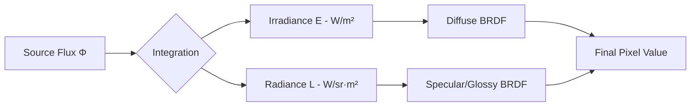

# Mastering Radiometric Standards: Flux, Radiance, and Irradiance for Physically Based Rendering

When developing a custom rendering engine, the most common source of "energy leakage"—where your scene appears too dark or suspiciously bright—is a fundamental misunderstanding of **radiometric standards**. Confusing **W/m²** (Irradiance) with **W/sr** (Radiance) often leads to incorrect light integration, breaking the Law of Conservation of Energy. To build a robust physically based renderer, you must master the relationship between **Radiant Flux**, **Irradiance**, and **Radiance**.

## Defining the Radiometric Foundation
In the context of light transport, **Radiant Flux ($\Phi$)** is the total power emitted, reflected, or transmitted by a source, measured in Watts (W). While useful for high-level energy accounting, flux alone is insufficient for rendering because it doesn't describe the light's direction or distribution.

**Irradiance ($E$)**, measured in **W/m²**, defines the flux density incident on a surface. Crucially, this is an area-based quantity. If your engine calculates illumination using a simple flux-to-area division without accounting for the cosine of the incident angle (Lambert’s Cosine Law), your results will diverge from physical reality.

**Radiance ($L$)**, however, is the fundamental quantity for rendering. Measured in **W/(sr·m²)**, it describes the density of radiant flux per unit of projected area *per unit of solid angle*. The confusion often arises when engineers conflate the two: attempting to store Irradiance in a texture intended for Radiance (or vice-versa) results in a miscalculation of the light's directional dependence.

## Why Energy Loss Occurs in Custom Engines
The primary cause of energy loss in rendering pipelines is the incorrect application of the Rendering Equation. If you treat Radiance as if it were Irradiance, you fail to account for the differential solid angle ($d\omega$). 

As detailed in the foundational concepts of our manuscript on *Physically Based Light Transport*, the transformation between these units is not merely a scalar shift; it is a change in the dimensionality of your integral. When your code performs a `dot(N, L)` operation, it is effectively projecting your incident radiance onto the surface area to derive the irradiance.

## Visualizing the Cosine Falloff
The following visualization demonstrates how the distribution of energy changes relative to the surface normal, highlighting the difference between flux density on a surface and the directional intensity.

[PLOT_SCRIPT]
import matplotlib.pyplot as plt
import numpy as np

theta = np.linspace(-np.pi/2, np.pi/2, 100)
radiance = np.ones_like(theta)
irradiance = np.cos(theta)

plt.figure(figsize=(8, 5))
plt.plot(theta, radiance, label='Radiance (W/sr·m²)')
plt.plot(theta, irradiance, label='Irradiance (W/m²)')
plt.title('Radiance vs Irradiance over Incident Angle')
plt.xlabel('Angle (radians)')
plt.ylabel('Magnitude (Normalized)')
plt.legend()
plt.grid(True)
plt.savefig('plot.png')
[/PLOT_SCRIPT]

## Architecting for Physical Correctness
To ensure your engine adheres to the principle of energy conservation, you must ensure your shaders are explicitly aware of their radiometric context. 

1. **Light Sources:** Calculate power as flux, then convert to radiance for surface shading.
2. **Surface Integration:** Always operate in radiance, applying the cosine term during the integration step.
3. **Materials:** Ensure your BRDFs are normalized to conserve energy (i.e., the integral of the BRDF must not exceed 1).

For those who find these mathematical transitions between flux, radiance, and irradiance daunting, my recent book offers a deep dive into the underlying physics of light transport. It serves as an excellent resource for grounding your engine’s math in rigorous physical theory, ensuring that your light transport kernels are as efficient as they are accurate. By aligning your implementation with these standards, you eliminate the "black box" guesswork that plagues many custom rendering projects.

  

  

    

      <h3 style="color: var(--accent); margin-bottom: 10px;">Master Digital Rendering Engineering</h3>
      
Support our research and get full access to the complete DRE Manuscript, HLSL Code Packs, and Math Cheat Sheets.

      <a href="https://dre.jmsage.pro" class="hero-btn" style="margin-top: 15px; display: inline-block; padding: 0.8rem 1.5rem; text-decoration: none;">Explore the Premium Modules &rarr;</a>
    

    

      
    

  

