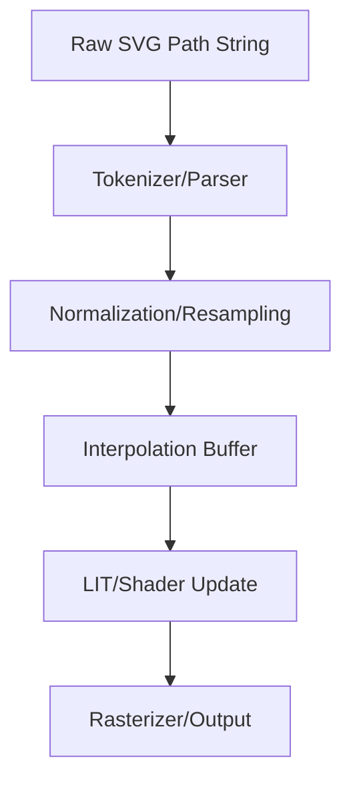

# Animating SVG Paths: Transforming Vector Graphics Through Programmatic Manipulation

For graphics engineers, SVG is far more than a static declaration of vectors. It is a dynamic data structure. When you move beyond CSS transitions and enter the realm of programmatic manipulation—whether you are optimizing for a custom engine or building a bridge between `DirectX 12` path rendering architectures and web-based displays—the core challenge lies in the geometric interpolation of path data strings.

Achieving smooth animations requires us to treat the `d` attribute of an SVG `<path>` not as a string, but as an array of commands and parameters. To create performant, dynamic animations, we must implement efficient parsing and linear interpolation (LERP) between these coordinate sets. If you have ever wondered how to implement smooth path morphing in `HLSL` shaders or how high-performance `Unreal Engine 5` UI systems handle complex spline deformation, the secret lies in the underlying math of coordinate normalization and cubic Bezier state transitions.

## The Mathematical Foundation of Path Morphing

The primary pain point for most developers is that SVG paths are often non-isomorphic. Path A (e.g., a circle) and Path B (a polygon) rarely share the same number of vertices or command types. To programmatically interpolate between them, one must perform a "normalization" step.

According to the principles of path data serialization, we must decompose path strings into discrete segment types: `M` (move to), `L` (line to), `C` (cubic Bézier), and `Z` (close path). By breaking these into a consistent data structure—a flattened list of coordinate pairs—we can apply standard interpolation functions across time $t \in [0, 1]$.

## Architectural Flow for Path Interpolation

When building an animation engine, we must ensure that the path data structure is updated at a high frequency. The following logic flow illustrates the transition from a raw SVG string to a rendered frame.

## Implementing the Engine

To handle complex path data, you need to normalize the segment count. If Path A has 4 segments and Path B has 8, you must subdivide Path A to match the complexity of Path B. This ensures that when you iterate through the coordinate buffers, you are never attempting to interpolate an undefined vector.

    <h4 style="margin: 0 0 10px 0; color: #e6edf3; font-size: 1.2rem; font-family: 'Inter', sans-serif;">Master the Complete Architecture</h4>
    
If you are enjoying this deep dive, consider reading the full mathematical thesis in <strong>Digital Rendering Engineering: The Complete Substrate</strong>. Get direct access to all HLSL source code packs, premium physical copies, and the entire chapter library.

    <a href="https://dre.jmsage.pro" target="_blank" style="display: inline-block; background: transparent; border: 1px solid #00f3ff; color: #00f3ff; text-decoration: none; padding: 8px 16px; border-radius: 4px; font-weight: bold; font-size: 0.85rem; text-transform: uppercase; transition: 0.2s;">Explore the Storefront →</a>

### Challenges in High-Performance Rendering
When integrating these animations into graphics pipelines—such as `Unreal Engine 5` path nodes or `DirectX 12` command buffers—you are essentially passing vertex buffers to the GPU. Ensure your interpolation math occurs on the CPU thread to minimize latency before sending the data to your `HLSL` vertex shader. By keeping the path manipulation logic separate from the drawing call, you enable frame-rate independent animations that feel snappy and responsive, regardless of the browser or device capability.

By strictly controlling the path data structure and pre-calculating the vertex counts, you eliminate the jitter commonly associated with programmatic SVG animation, resulting in fluid, professional-grade visual feedback.