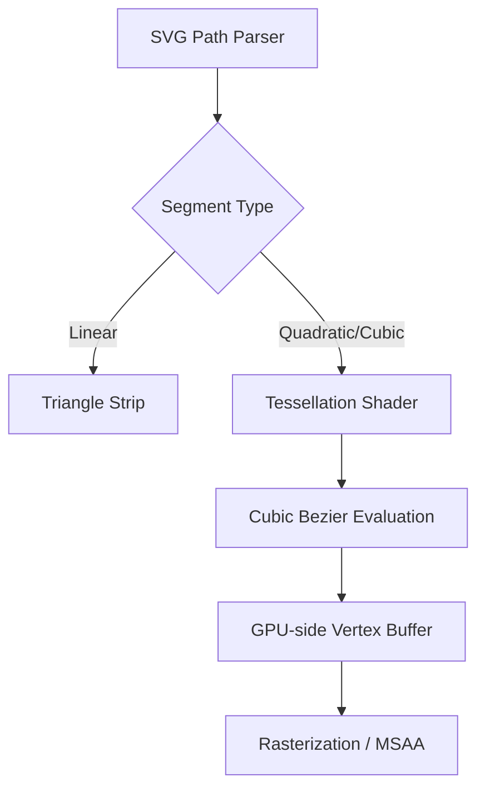

# Real-time SVG Rendering: Strategies for High-Performance Vector Graphics

Achieving smooth, interactive rendering of SVG at high frame rates can be challenging, particularly on resource-constrained devices. As a graphics engineer, balancing resolution-independent clarity with the raw throughput required for 60+ FPS environments often requires moving beyond standard CPU-side rasterization. Whether you are implementing custom vector pipelines in HLSL, optimizing your DirectX 12 render loop, or profiling path-based geometry in Unreal Engine 5, understanding the underlying mathematical primitives is the first step toward building a high-performance vector engine.

## The Geometry of Path Data

At the heart of any SVG is the path data string—a dense collection of commands (M, L, C, Q). In resource-constrained scenarios, we cannot afford to convert these to pixels on the CPU. Instead, we must treat these paths as geometry. The data provided in our technical specification demonstrates the density of path segments commonly encountered in vector assets:

## Implementing Efficient Tessellation in HLSL

When moving to a modern GPU-accelerated pipeline, we replace the CPU rasterizer with a vertex-processing approach. The goal is to approximate the smooth curves of a Cubic Bezier into a series of linear segments based on a curvature threshold.

The mathematical foundation for our path evaluation relies on the De Casteljau algorithm or the standard Bernstein polynomial form: $B(t) = (1-t)^3P_0 + 3(1-t)^2tP_1 + 3(1-t)t^2P_2 + t^3P_3$. To optimize this for an HLSL compute shader, we evaluate the flatness of the curve to determine the subdivision count dynamically, ensuring we don't over-tessellate distant objects.

## Advanced Optimization: DirectX 12 and Beyond

The primary bottleneck in real-time SVG rendering is the fill-rule evaluation (Even-Odd vs. Non-Zero). In a DirectX 12 architecture, this is best handled via a stencil-based approach. By rendering the stencil mask of the path geometry and performing a screen-aligned pass to fill the bounded regions, you minimize overdraw and avoid costly CPU-side polygon clipping.

For developers working in Unreal Engine 5, leveraging the Niagara framework to treat individual path segments as particles can offer a massive performance boost for complex, animated vector interfaces. This shifts the compute burden entirely to the GPU's asynchronous compute queues, leaving the main game thread free for logic and physics.

    <h4 style="margin: 0 0 10px 0; color: #e6edf3; font-size: 1.2rem; font-family: 'Inter', sans-serif;">Master the Complete Architecture</h4>
    
If you are enjoying this deep dive, consider reading the full mathematical thesis in <strong>Digital Rendering Engineering: The Complete Substrate</strong>. Get direct access to all HLSL source code packs, premium physical copies, and the entire chapter library.

    <a href="https://dre.jmsage.pro" target="_blank" style="display: inline-block; background: transparent; border: 1px solid #00f3ff; color: #00f3ff; text-decoration: none; padding: 8px 16px; border-radius: 4px; font-weight: bold; font-size: 0.85rem; text-transform: uppercase; transition: 0.2s;">Explore the Storefront →</a>

## Architectural Best Practices

1. **Path Flattening:** Pre-process complex SVG files into flattened vertex buffers during the asset import stage to minimize runtime CPU overhead.
2. **Batching Draw Calls:** Use bindless resource descriptors to store path data in StructuredBuffers, allowing you to draw hundreds of distinct SVG elements in a single `DrawIndexedInstanced` call.
3. **Texture Atlas Generation:** For static SVG elements, perform a one-time "raster-to-texture" pass during asset loading to cache complex shapes into a distance field texture, which provides high-quality scaling at zero runtime cost.

By shifting the focus from CPU-rasterized bitmaps to GPU-tessellated geometry, you ensure your vector rendering pipeline scales gracefully across mobile, console, and desktop hardware. The key is to treat paths as data-driven geometry, utilize the power of modern shaders to handle curve approximation, and minimize state changes within your command buffers.