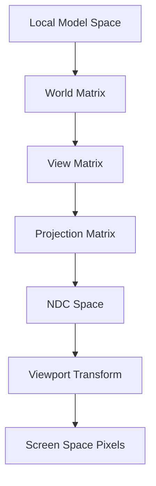

# The Role of Linear Algebra in 3D Graphics: A Foundational Review

For many junior and mid-level graphics engineers, the transition from high-level engine abstractions to the "metal" of the pipeline can be daunting. You might be comfortable calling `DrawIndexedInstanced` in DirectX 12 or utilizing compute shaders for particle systems, but when the math behind custom camera projections or non-linear light attenuation breaks, the lack of a deep mathematical bedrock becomes a bottleneck. Understanding linear algebra isn't just an academic exercise; it is the fundamental language of GPU architecture.

## Matrix Transformations: The Engine Room of the Pipeline

In modern graphics, every object's journey from local model space to screen space is a linear transformation. We represent these as $4 \times 4$ matrices to accommodate translation via homogeneous coordinates. If you are struggling to debug why your mesh is clipping incorrectly or why your normals are skewing after a non-uniform scale, you are likely missing an understanding of how transformation matrices manipulate basis vectors.

When moving between coordinate systems, remember that the **Model-View-Projection (MVP)** matrix is the product of three distinct linear mappings. A common pitfall in HLSL shaders is the improper order of operations; since matrix multiplication is non-commutative, swapping the order of rotation and translation will yield entirely different results.

## Projections and Clipping

Projection matrices define your view frustum and map the 3D world into the Normalized Device Cube (NDC). For graphics engineers working in DirectX 12 or Vulkan, understanding the difference between orthographic and perspective projections is vital. The perspective projection is a non-linear transformation that makes use of the $w$-component of our 4D vectors to create the "foreshortening" effect.

    <h4 style="margin: 0 0 10px 0; color: #e6edf3; font-size: 1.2rem; font-family: 'Inter', sans-serif;">Master the Complete Architecture</h4>
    
If you are enjoying this deep dive, consider reading the full mathematical thesis in <strong>Digital Rendering Engineering: The Complete Substrate</strong>. Get direct access to all HLSL source code packs, premium physical copies, and the entire chapter library.

    <a href="https://dre.jmsage.pro" target="_blank" style="display: inline-block; background: transparent; border: 1px solid #00f3ff; color: #00f3ff; text-decoration: none; padding: 8px 16px; border-radius: 4px; font-weight: bold; font-size: 0.85rem; text-transform: uppercase; transition: 0.2s;">Explore the Storefront →</a>

## Understanding Lighting Calculations

Lighting is essentially the evaluation of the Rendering Equation. At its core, the Blinn-Phong or PBR (Physically Based Rendering) workflows rely heavily on dot products. The dot product between a surface normal and a light vector provides the cosine of the angle between them, which is the foundational scalar for calculating intensity in diffuse lighting models.

To visualize how light falloff—specifically the Inverse Square Law—impacts the visual fidelity of your scene, consider the following distribution of intensity over distance:

## Architectural Flow of Transformations

If you are currently optimizing your renderer for Unreal Engine 5 or writing custom shader permutations, it is helpful to visualize the transformation hierarchy. The transformation flow from local space to clip space follows a specific, repeatable pipeline:

## Deepening Your Mastery

As you continue to refine your rendering engine, remember that optimization often lies in the math. Whether it's reducing matrix-matrix multiplications by pre-calculating concatenated transforms or using quaternions to avoid gimbal lock during camera rotation, the depth of your linear algebra knowledge directly dictates the performance and stability of your rendering pipeline.

Focus on mastering the underlying dot and cross product identities. They are the keys to implementing efficient lighting, back-face culling, and camera frustum intersection tests—the core pillars of any professional-grade graphics engine.