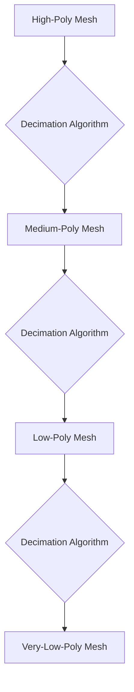

# Optimizing 3D Model Meshes: Techniques for Performance and Memory Footprint

As Senior Rendering Engineers, we constantly grapple with the intricate dance between visual fidelity and computational efficiency. One of the most pervasive bottlenecks in modern real-time 3D rendering stems from unoptimized 3D models. Excessive polygon counts, inefficient UV layouts, and redundant data can severely cripple rendering performance, leading to lower frame rates and consuming precious GPU memory. This article delves into the critical techniques for optimizing 3D model meshes, ensuring your scenes are not only visually stunning but also performant.

## Understanding the Problem: Why Mesh Optimization Matters

The core of any 3D scene is its geometry. A 3D model is typically represented as a collection of vertices, edges, and faces forming a mesh. For complex objects, this mesh can comprise millions of polygons. Every polygon, every vertex, and every associated attribute (like UV coordinates, normals, and vertex colors) needs to be processed by the GPU. When these elements are present in excessive, unmanaged quantities, the consequences are profound:

*   **Increased Vertex Processing:** More vertices mean more data to transfer from system memory to GPU memory and more calculations for vertex shaders.
*   **Higher Triangle Counts:** A higher number of triangles directly impacts the rasterization stage and pixel shading workload.
*   **Memory Bandwidth Strain:** Transferring large amounts of vertex and index data consumes valuable memory bandwidth, a common bottleneck.
*   **Increased Cache Misses:** The GPU's caches, crucial for fast data retrieval, can become less effective when dealing with sprawling, unoptimized data.
*   **Larger Shader Instruction Counts:** Complex meshes can necessitate more elaborate shaders to handle attributes, further increasing the GPU's computational load.

## Core Techniques for Mesh Optimization

Achieving optimal mesh performance involves a multi-faceted approach, focusing on reducing unnecessary data while preserving visual quality.

### 1. Polygon Reduction (Decimation)

The most direct method for reducing polygon count is mesh decimation. This process involves algorithms that simplify a mesh by removing vertices and faces while trying to maintain the overall shape and silhouette.

**Algorithmic Approaches:**

Several algorithms exist for decimation, each with its trade-offs. A common class of algorithms is based on **Quadric Error Metrics (QEM)**. The core idea is to associate a quadric error matrix with each vertex. This matrix represents the sum of squared distances from the vertex to the planes of the triangles incident to it. When two vertices are merged, their quadric matrices are also combined. The algorithm then iteratively collapses edges or merges vertices that result in the smallest quadric error, effectively approximating the original surface with a simpler mesh.

Mathematically, for a vertex $v$, its associated quadric $Q_v$ can be expressed as:
$Q_v = \sum_{i} (v \cdot n_i - d_i)^2$, where $n_i$ and $d_i$ are the normal and distance from the origin for the planes of the triangles incident to $v$.

When merging two vertices $v_1$ and $v_2$ to a new vertex $v_3 = v_1 + v_2$, the quadric for the new vertex is $Q_3 = Q_1 + Q_2$. The optimal position for $v_3$ is found by minimizing the error, which involves solving a linear system derived from the quadric.

**Level of Detail (LOD) Generation:**

Polygon reduction is fundamental to creating Levels of Detail (LODs). LODs are multiple versions of the same mesh, each with a progressively lower polygon count. At runtime, the system selects the appropriate LOD based on the object's distance from the camera. This significantly reduces the rendering workload for distant objects.

A simplified illustration of LOD generation can be visualized as progressively simplifying a mesh.



### 2. UV Unwrapping and Texture Space Optimization

While polygon count is crucial for geometry processing, inefficient UV layouts can disproportionately impact texture sampling performance and memory usage. UV coordinates map vertices in 3D space to points on a 2D texture.

**Key Considerations:**

*   **Overlapping UVs:** Generally, overlapping UVs are problematic unless specifically intended for instanced textures. They can cause visual artifacts and prevent unique texture details from being applied.
*   **Texture Packing:** Efficiently packing UV islands (contiguous regions of UVs) into the available texture space (0 to 1 on both axes) maximizes texture resolution and minimizes wasted texture memory. Algorithms like **Maximal Rectangular Packing** or **Geometric Hashing** can be employed.
*   **Seams and Texel Density:** Strategically placing UV seams minimizes visual distortion from texture filtering. Maintaining consistent texel density across different parts of a model ensures uniform texture detail.

### 3. Data Deduplication and Efficient Representation

Redundant data within a mesh can also bloat memory footprints and increase processing time.

**Common Redundancies:**

*   **Duplicate Vertices:** Multiple vertices with identical positions, UVs, normals, and other attributes. These can often be merged into a single unique vertex. Vertex merging algorithms, often integrated into decimation or mesh processing pipelines, can handle this.
*   **Redundant Normals/Tangents:** If vertex normals or tangents are identical for adjacent faces, they might be redundant depending on the shading model and whether smooth shading is desired.
*   **Unused Data:** Attributes (like vertex colors) that are not used by the shader are simply dead weight.

**Vertex Buffer Optimization:**

Efficiently structuring vertex data is paramount. A single vertex can store:
*   Position (e.g., `float3`)
*   Normal (e.g., `float3`)
*   Tangent (e.g., `float3`)
*   Bi-tangent (e.g., `float3`)
*   UV Coordinates (e.g., `float2` for primary, `float2` for secondary)
*   Vertex Colors (e.g., `float4`)

The key is to only include attributes that are *necessary* for rendering the model with its intended visual effects.

### 4. Mesh Simplification Algorithms Beyond Decimation

While decimation focuses on reducing polygon count, other simplification techniques can be applied:

*   **Vertex Clustering:** This is a faster, albeit less precise, method. It divides the model's bounding box into a grid of voxels. All vertices falling within a voxel are merged into a single representative vertex. This is efficient for quickly generating very low-poly LODs or for situations where perfect geometric fidelity is less critical.

*   **Edge Collapse:** This is a fundamental operation in many decimation algorithms. An edge between two vertices $v_1$ and $v_2$ is collapsed, merging them into a single vertex. The position of this new vertex is determined by an optimization criterion (e.g., minimizing QEM, or optimizing for edge length).


<div style="background: #0d1117; border-left: 4px solid #00f3ff; border-radius: 6px; padding: 20px; margin: 30px 0; box-shadow: 0 4px 15px rgba(0,0,0,0.3);">
    <h4 style="margin: 0 0 10px 0; color: #e6edf3; font-size: 1.2rem; font-family: 'Inter', sans-serif;">Master the Complete Architecture</h4>
    <p style="color: #8b949e; margin: 0 0 15px 0; font-size: 0.95rem; font-family: 'Inter', sans-serif;">If you are enjoying this deep dive, consider reading the full mathematical thesis in <strong>Digital Rendering Engineering: The Complete Substrate</strong>. Get direct access to all HLSL source code packs, premium physical copies, and the entire chapter library.</p>
    <a href="https://dre.jmsage.pro" target="_blank" style="display: inline-block; background: transparent; border: 1px solid #00f3ff; color: #00f3ff; text-decoration: none; padding: 8px 16px; border-radius: 4px; font-weight: bold; font-size: 0.85rem; text-transform: uppercase; transition: 0.2s;">Explore the Storefront →</a>
</div>


## Implementing Optimization Techniques

The implementation of these techniques often involves specialized software or custom algorithms.

**Common Tools and Libraries:**

*   **Blender:** Offers robust decimation modifiers and UV unwrapping tools.
*   **Maya/3ds Max:** Similar to Blender, these DCC tools provide built-in mesh optimization features.
*   **Simplygon, InstaMSH, MeshLab:** Dedicated software for advanced mesh processing and optimization.
*   **Custom C++ Libraries:** Libraries like CGAL (Computational Geometry Algorithms Library) can be integrated for programmatic mesh manipulation.

**Example: A Conceptual Python Script for Vertex Merging**

This Python script illustrates a simplified concept of merging nearly identical vertices. In a real-world scenario, tolerance values and more sophisticated data structures (like KD-trees) would be used for efficiency.

```python
import numpy as np
import matplotlib.pyplot as plt

def merge_vertices(vertices, tolerance=0.01):
    """
    Simplified function to merge nearly identical vertices.
    In a real-time scenario, this would be far more complex and efficient.
    """
    num_vertices = vertices.shape[0]
    unique_indices = []
    merged_vertex_map = {} # Maps original index to its new unique index

    for i in range(num_vertices):
        is_duplicate = False
        for unique_idx in unique_indices:
            # Calculate Euclidean distance between current vertex and a unique vertex
            distance = np.linalg.norm(vertices[i] - vertices[unique_idx])
            if distance < tolerance:
                merged_vertex_map[i] = unique_idx
                is_duplicate = True
                break
        if not is_duplicate:
            unique_indices.append(i)
            merged_vertex_map[i] = i # This vertex is its own unique representative

    # Create the new, merged vertex array
    merged_vertices = vertices[unique_indices]
    return merged_vertices, merged_vertex_map

# Example Usage
# Generate some sample 3D vertices with some duplicates
np.random.seed(42)
num_original_vertices = 100
# Create some clusters of points to simulate near-duplicates
cluster_centers = np.random.rand(5, 3) * 10
original_vertices = np.vstack([
    center + (np.random.rand(20, 3) - 0.5) * 0.1
    for center in cluster_centers
])

# Add a few more points to ensure some are truly unique
original_vertices = np.vstack([original_vertices, np.random.rand(10, 3) * 10])

print(f"Original number of vertices: {original_vertices.shape[0]}")

merged_vertices, vertex_map = merge_vertices(original_vertices, tolerance=0.2)

print(f"Number of vertices after merging: {merged_vertices.shape[0]}")

# Visualize the original and merged vertices
plt.figure(figsize=(10, 5))

plt.subplot(1, 2, 1)
plt.scatter(original_vertices[:, 0], original_vertices[:, 1], alpha=0.6)
plt.title("Original Vertices")
plt.xlabel("X")
plt.ylabel("Y")
plt.grid(True)

plt.subplot(1, 2, 2)
plt.scatter(merged_vertices[:, 0], merged_vertices[:, 1], alpha=0.6, color='red')
plt.title("Merged Vertices")
plt.xlabel("X")
plt.ylabel("Y")
plt.grid(True)

plt.tight_layout()
plt.savefig('plot.png')
```


## Performance Impact and Measurement

The impact of mesh optimization is directly quantifiable. Monitoring key performance indicators (KPIs) before and after optimization is crucial.

**Key Metrics to Track:**

*   **Frame Rate (FPS):** The most obvious indicator of rendering performance.
*   **GPU Memory Usage:** Monitor the total VRAM consumed by scene assets.
*   **Draw Call Count:** While not directly mesh optimization, simpler meshes can sometimes lead to fewer draw calls if LODs or instancing are implemented effectively.
*   **Vertex Shader Execution Time:** Profile specific shader stages to identify bottlenecks.
*   **Triangle Count Per Frame:** Tools like RenderDoc or built-in engine profilers can show the active triangle count.

## Conclusion

Optimizing 3D model meshes is not merely an art; it's a science rooted in understanding computational geometry and GPU architecture. By diligently applying techniques such as polygon reduction for LODs, efficient UV unwrapping, and rigorous data deduplication, we can significantly reduce the performance and memory footprint of our 3D scenes. This allows for more complex and visually rich environments, ultimately leading to a superior end-user experience. Continuously profiling and iterating on mesh optimization strategies is a cornerstone of high-performance real-time graphics.