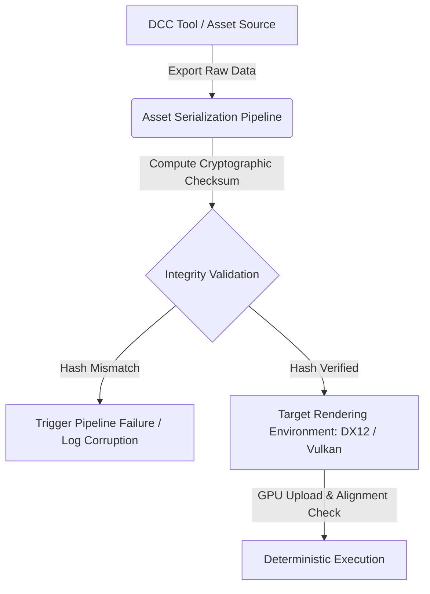

# Beyond "It Works on My Machine": Ensuring Data Integrity Across Rendering Environments

Every graphics programmer knows the sinking feeling of launching a scene on a staging machine or continuous integration pipeline only to watch it devolve into a nightmare of blown-out HDR values, scrambled UV layouts, and NaN-poisoned fragments. Rendering projects frequently suffer from catastrophic visual inconsistencies when moving assets between disparate systems, operating systems, and DCC tools. These discrepancies stem from subtle data corruption, differing floating-point accumulation strategies, endianness assumptions, and implicit driver-level conversions. 

To achieve deterministic rendering pipelines, we must enforce rigorous data integrity protocols. This requires a deep dive into how data structures are parsed, serialized, and consumed across the rendering architecture.

## The Anatomy of Cross-Platform Corruption

Data corruption in rendering environments rarely manifests as a hard crash. Instead, it appears as insidious artifacts: a normal map inverted along the green channel because of DirectX versus OpenGL coordinate conventions, or lighting intensity shifting due to unmanaged sRGB color space conversions performed silently by a texture importer. 

When designing high-performance systems like a DirectX 12 rendering backend, maintaining bitwise and semantic parity across environments requires strict adherence to memory layouts. Serialization pipelines often fail when structures packed on the CPU using 32-bit alignment are mapped directly to GPU buffers without accounting for hardware-specific struct padding rules.



## Implementing Robust Validation in HLSL and C++

To ensure that data arriving in your HLSL shaders matches what was authored, you must eliminate ambiguity in your pipeline's data ingestion stage. Let us examine how to implement a validation layer that checks buffer integrity before binding resources to the pipeline state object (PSO).

When transferring vertex and material data, computing a deterministic checksum during the asset cooking phase allows the runtime to verify that no truncation or endianness swapping occurred during network transit. 

```hlsl
// HLSL Material Buffer Layout with explicit padding to prevent layout drift
struct MaterialData {
    float4 baseColorFactor;
    float3 emissiveFactor;
    float roughnessFactor;
    uint textureFlags; // Bitmask for active textures
    uint padding0;
    uint padding1;
    uint padding2;
};

ConstantBuffer<MaterialData> g_Material : register(b0, space0);

float4 EvaluateMaterial(float2 uv) {
    // Validate flags to ensure data wasn't corrupted in flight
    if ((g_Material.textureFlags & 0x80000000) != 0) {
        // Handle corrupted bitmask fallback
        return g_Material.baseColorFactor;
    }
    return g_Material.baseColorFactor;
}
```

By enforcing explicit padding (`padding0`, `padding1`, `padding2`), we guarantee that the constant buffer layout matches the C++ `alignas(16)` specification, preventing subtle driver-dependent structural remappings that corrupt data when moving between NVIDIA and AMD hardware architectures.


<div style="background: #0d1117; border-left: 4px solid #00f3ff; border-radius: 6px; padding: 20px; margin: 30px 0; box-shadow: 0 4px 15px rgba(0,0,0,0.3);">
    <h4 style="margin: 0 0 10px 0; color: #e6edf3; font-size: 1.2rem; font-family: 'Inter', sans-serif;">Master the Complete Architecture</h4>
    <p style="color: #8b949e; margin: 0 0 15px 0; font-size: 0.95rem; font-family: 'Inter', sans-serif;">If you are enjoying this deep dive, consider reading the full mathematical thesis in <strong>Digital Rendering Engineering: The Complete Substrate</strong>. Get direct access to all HLSL source code packs, premium physical copies, and the entire chapter library.</p>
    <a href="https://dre.jmsage.pro" target="_blank" style="display: inline-block; background: transparent; border: 1px solid #00f3ff; color: #00f3ff; text-decoration: none; padding: 8px 16px; border-radius: 4px; font-weight: bold; font-size: 0.85rem; text-transform: uppercase; transition: 0.2s;">Explore the Storefront →</a>
</div>


## Managing Precision Loss and Floating-Point Determinism

Floating-point representation is another vector for silent data corruption. Different hardware architectures, compiler optimization flags (`/fp:fast` vs `/fp:precise`), and math library implementations can alter the least significant bits of vertex transformations and lighting calculations. 

To visualize how minor precision variations compound over iterative rendering passes, we can analyze the distribution error across different IEEE 754 floating-point rounding modes.


## Architectural Strategies for Multi-Tool Pipelines

When building pipelines that scale across Unreal Engine 5, custom proprietary engines, and third-party DCC tools, enforcing data integrity requires a multi-layered defense:

1. **Schema-Driven Asset Formats**: Use strict schema definitions (such as FlatBuffers or Protocol Buffers) rather than loose JSON or proprietary binary dumps. This ensures backward compatibility and explicit field-type enforcement.
2. **Cryptographic Hashing at Ingest**: Attach SHA-256 hashes to asset metadata. If the hash calculated at runtime does not match the asset registry manifest, reject the load immediately rather than rendering corrupted geometry.
3. **Automated Headless CI Verification**: Run headless rendering regression tests inside containerized environments to compare frame outputs pixel-by-pixel against reference hashes before assets reach artist workstations.

By treating data integrity as an engineering constraint rather than an afterthought, you banish the "it works on my machine" curse permanently, ensuring rock-solid stability across every rendering environment.