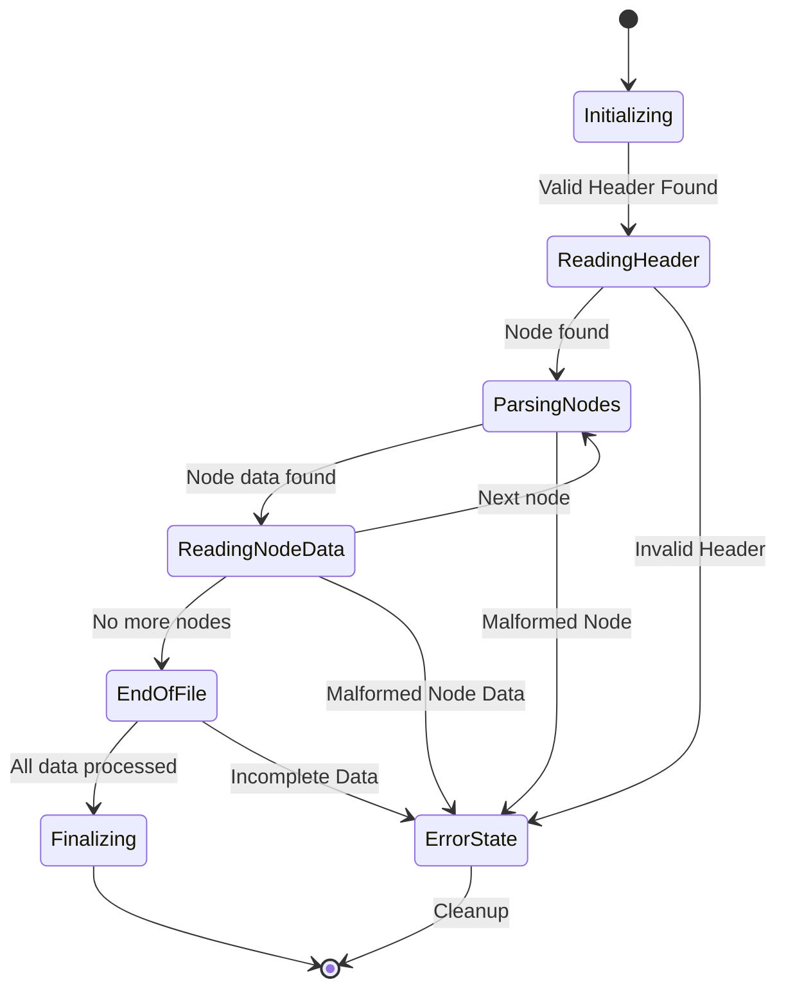

# Defensive Programming Techniques for Rendering Engine Input Processors

Developing a high-performance rendering engine, whether it's for AAA game development leveraging techniques akin to Unreal Engine 5's rendering architecture, or for real-time scientific visualization, often involves processing a vast amount of input data. This input can originate from various sources: scene description files, user interactions, network streams, or procedurally generated content. The integrity and predictability of this input are paramount. A single malformed or unexpected data point can cascade into rendering artifacts, performance degradation, or even catastrophic engine crashes. This article delves into crucial defensive programming techniques specifically tailored for rendering engine input processors, ensuring your graphics pipelines remain robust and stable.

## Why Defensive Programming is Crucial for Rendering Input

In graphics programming, particularly when implementing complex rendering features like advanced material systems in HLSL or managing buffers in DirectX 12, input validation is not merely a good practice; it's a fundamental requirement for stability. Rendering engines are resource-intensive, and unexpected input can lead to out-of-bounds memory accesses, invalid state transitions, or infinite loops. Defensive programming empowers us to anticipate these issues and implement safeguards.

Consider a scenario where your engine parses a model file. A vertex buffer might have an incorrect number of components, a texture coordinate might be NaN, or a material parameter might exceed its expected range. Without explicit checks, attempting to use this data could lead to undefined behavior.

The core principle is to **assume nothing** about the input. Every piece of data received by an input processor should be treated as potentially hostile or erroneous until proven otherwise. This mindset underpins the techniques discussed below.

## Input Validation Strategies

Robust input processing begins with comprehensive validation. This involves checking data types, ranges, and logical consistency.

### 1. Type and Range Checking

The most basic form of validation is ensuring that incoming data conforms to expected types and falls within acceptable ranges. For instance, a color value should typically be within [0, 1] or [0, 255] depending on the representation. A texture dimension should be positive.

A common pattern is to use `assert` statements during development to catch obvious errors early. However, for production code, these assertions should be replaced with explicit error handling mechanisms.

#### Example: Validating Vertex Attributes

Let's consider a simplified scenario for processing vertex data. We might expect position, normal, and UV coordinates.

```cpp
struct VertexData {
    float position[3];
    float normal[3];
    float uv[2];
};

// Function to process raw vertex data
bool ProcessRawVertexData(const RawVertexData& rawData, VertexData& processedData) {
    // Validate position
    for (int i = 0; i < 3; ++i) {
        if (std::isnan(rawData.position[i]) || std::isinf(rawData.position[i])) {
            LogError("Invalid position component: NaN or Inf detected.");
            return false;
        }
        // Optional: Add range checks if positions have known bounds (e.g., within a scene bounding box)
    }

    // Validate normal
    for (int i = 0; i < 3; ++i) {
        if (std::isnan(rawData.normal[i]) || std::isinf(rawData.normal[i])) {
            LogError("Invalid normal component: NaN or Inf detected.");
            return false;
        }
    }
    // Normalization check: ensure the normal vector is normalized (or handle it)
    float normalLengthSq = rawData.normal[0]*rawData.normal[0] + rawData.normal[1]*rawData.normal[1] + rawData.normal[2]*rawData.normal[2];
    if (std::abs(normalLengthSq - 1.0f) > 1e-5) { // Allow for small floating point inaccuracies
        LogWarning("Normal vector is not normalized. Attempting to normalize.");
        // Normalize the normal vector here or return an error
    }

    // Validate UV coordinates
    for (int i = 0; i < 2; ++i) {
        if (std::isnan(rawData.uv[i]) || std::isinf(rawData.uv[i])) {
            LogError("Invalid UV component: NaN or Inf detected.");
            return false;
        }
        // Optional: Clamp UVs to [0, 1] if wrap-around is not desired or explicitly handled.
        // processedData.uv[i] = std::clamp(rawData.uv[i], 0.0f, 1.0f);
    }

    // If all checks pass, populate the processed data
    memcpy(processedData.position, rawData.position, sizeof(rawData.position));
    memcpy(processedData.normal, rawData.normal, sizeof(rawData.normal));
    memcpy(processedData.uv, rawData.uv, sizeof(rawData.uv));

    return true;
}
```

The `LogError` and `LogWarning` functions would be part of your engine's logging system. This structured approach, returning `bool` to indicate success or failure, is a common defensive pattern.

### 2. Logical Consistency Checks

Beyond individual value validation, it's crucial to check for logical consistency between related data points. For example:
*   **Triangle Winding Order:** Ensure triangles are consistently ordered (e.g., counter-clockwise) for correct backface culling.
*   **Bounding Box Validity:** The minimum corner of a bounding box should have coordinates less than or equal to the corresponding maximum corner coordinates.
*   **UV Channel Count:** If a mesh has multiple UV channels, ensure the count specified matches the actual data provided.
*   **Matrix Invertibility:** When processing transformation matrices, checking for singularity (determinant close to zero) is vital before attempting inversion.

#### Example: Bounding Box Validation

```cpp
struct BoundingBox {
    float min[3];
    float max[3];
};

bool IsValidBoundingBox(const BoundingBox& box) {
    for (int i = 0; i < 3; ++i) {
        if (box.min[i] > box.max[i] + 1e-5) { // Allow for small float errors
            return false;
        }
    }
    return true;
}
```

This simple check prevents degenerate or inverted bounding boxes from corrupting spatial queries or frustum culling.


<div style="background: #0d1117; border-left: 4px solid #00f3ff; border-radius: 6px; padding: 20px; margin: 30px 0; box-shadow: 0 4px 15px rgba(0,0,0,0.3);">
    <h4 style="margin: 0 0 10px 0; color: #e6edf3; font-size: 1.2rem; font-family: 'Inter', sans-serif;">Master the Complete Architecture</h4>
    <p style="color: #8b949e; margin: 0 0 15px 0; font-size: 0.95rem; font-family: 'Inter', sans-serif;">If you are enjoying this deep dive, consider reading the full mathematical thesis in <strong>Digital Rendering Engineering: The Complete Substrate</strong>. Get direct access to all HLSL source code packs, premium physical copies, and the entire chapter library.</p>
    <a href="https://dre.jmsage.pro" target="_blank" style="display: inline-block; background: transparent; border: 1px solid #00f3ff; color: #00f3ff; text-decoration: none; padding: 8px 16px; border-radius: 4px; font-weight: bold; font-size: 0.85rem; text-transform: uppercase; transition: 0.2s;">Explore the Storefront →</a>
</div>


## Robust Data Structures and Serialization

Defensive programming extends to how data is represented and transferred. Using well-defined data structures and employing robust serialization/deserialization practices can significantly reduce the surface area for input errors.

### 1. Immutable Data Structures

Where possible, design input processing stages to produce immutable data structures. This means that once created, the data cannot be modified. This greatly simplifies reasoning about data integrity and eliminates entire classes of bugs related to unintended state changes.

For instance, after parsing a mesh, you might store its vertex and index buffers in immutable formats that are then passed to the rendering pipeline.

### 2. Versioning and Feature Flags

Input data formats can evolve over time. Implementing versioning for file formats or network protocols allows your engine to gracefully handle older or newer versions of data. A clear version number at the beginning of a file or data packet enables your processor to select the appropriate parsing logic.

Feature flags can also be used to enable or disable certain input processing steps, allowing for backward compatibility or controlled rollout of new features.

### 3. Error Handling and Reporting

Instead of simply returning `false` or crashing, a robust input processor should provide informative error messages. This includes:
*   **Specific Error Codes/Enums:** Categorize errors (e.g., `INVALID_FORMAT`, `OUT_OF_RANGE`, `CONSISTENCY_ERROR`).
*   **Contextual Information:** Report the file name, line number, or specific data element that caused the error.
*   **Severity Levels:** Differentiate between critical errors that halt processing and warnings that allow it to continue with potential compromises.

This detailed reporting is invaluable for debugging and for providing feedback to users or content creators.

## Handling Unforeseen Data: Robustness Patterns

Even with rigorous validation, edge cases can exist. Employing specific patterns can further enhance resilience.

### 1. Default or Fallback Values

When input data is missing, invalid, or cannot be processed, providing sensible default values can prevent crashes. For example, if a material fails to load, it could fall back to a basic "default" material. If a texture coordinate is corrupted, it might default to (0,0).

The key is to ensure these defaults are safe and well-defined, minimizing visual or functional impact.

### 2. Sanitization and Clamping

Sometimes, input data might be slightly out of bounds but still usable if "sanitized". This can involve:
*   **Clamping:** Forcing values to stay within a predefined range (e.g., clamping RGB values to [0, 1]).
*   **Normalization:** Ensuring vectors are of unit length.
*   **Zeroing:** Replacing invalid numerical values (like NaN) with zero, if that's a safe fallback.

The choice between rejecting invalid input and sanitizing it depends on the criticality of the data and the desired user experience.

### 3. State Machines for Complex Input Sequences

For input that involves a sequence of operations or states (e.g., parsing a hierarchical scene graph, or processing animation keyframes), a state machine can be an excellent defensive programming tool. Each state represents a valid stage in the processing, and transitions are carefully defined. This prevents the processor from entering invalid states due to unexpected input sequences.



This state machine diagram illustrates a simplified flow for parsing a hierarchical scene. If an unexpected input is encountered at any stage, the processor can transition to an `ErrorState` and perform cleanup.

## Mathematical Underpinnings of Data Integrity

Many rendering computations rely on fundamental mathematical properties. Violations of these properties due to bad input can break algorithms.

### 1. Floating-Point Precision and Robustness

Graphics heavily relies on floating-point numbers. `NaN` (Not a Number) and `Infinity` are common artifacts of invalid operations (e.g., division by zero) or corrupted data. These values can propagate through calculations and lead to unpredictable results.

**Key Checks:**
*   `std::isnan(value)`
*   `std::isinf(value)`

**Mathematical Context:** In C++, `float` and `double` types adhere to the IEEE 754 standard. `NaN` is a special floating-point value that results from operations like `0/0` or `sqrt(-1)`. `Infinity` arises from operations like `1/0`. These values behave in specific ways in arithmetic operations, often propagating themselves or resulting in `NaN`. For instance, `NaN + x = NaN`, `Infinity * 0 = NaN`.

### 2. Vector and Matrix Properties

Geometric transformations, lighting calculations, and many other rendering processes depend on the properties of vectors and matrices.
*   **Vector Magnitude:** Ensuring vectors (like normals) are not zero-length before normalization is crucial.
*   **Matrix Determinant:** For operations like inversion, a determinant close to zero indicates a singular matrix, which cannot be inverted.

#### Example: Determinant of a 3x3 Matrix

For a 3x3 matrix:

$$
M = \begin{pmatrix}
a & b & c \\
d & e & f \\
g & h & i
\end{pmatrix}
$$

The determinant is calculated as:

$$
det(M) = a(ei - fh) - b(di - fg) + c(dh - eg)
$$


If `det(M)` is zero (or very close to zero due to floating-point inaccuracies), the matrix is singular.

Let's visualize the determinant calculation for a generic 3x3 matrix and demonstrate how a small change in one element can affect it.


This plot illustrates how sensitive the determinant is to individual element values. A slight deviation could push a near-singular matrix into singularity, leading to an uninvertible matrix.

## Conclusion

Implementing defensive programming in rendering engine input processors is a continuous effort that pays significant dividends in stability and maintainability. By rigorously validating input, using robust data structures, and employing fallback mechanisms, developers can build rendering pipelines that are resilient to malformed data. This proactive approach not only prevents crashes but also reduces debugging time and ultimately leads to a more polished and reliable graphics engine. Prioritizing these techniques early in development will save immense effort down the line, especially in complex projects such as those found in modern game engines or demanding visualization tools.